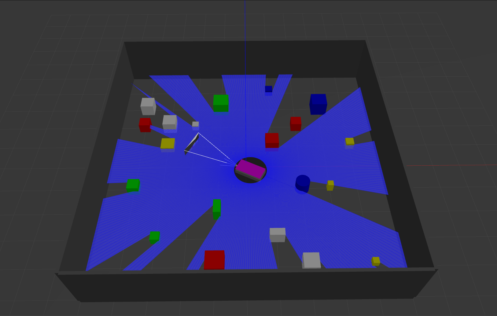
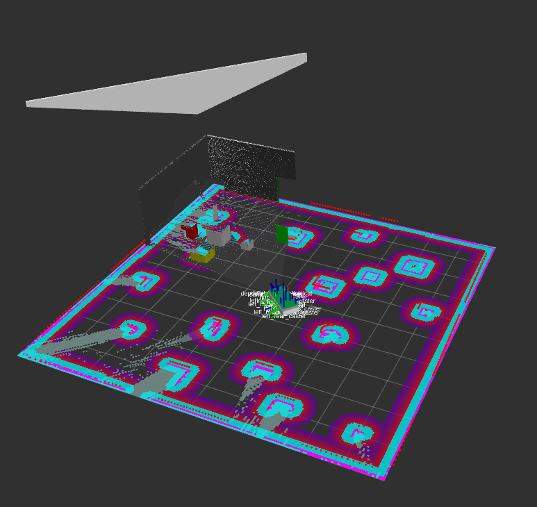
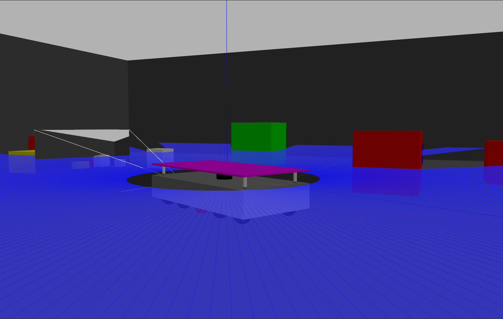

Play ground where I am currently making a simulation of a roomba-bot that uses deapth camera, lidar and RGB cam to move autonomusly. Based on ROS2 humble , SLAM and NAV2. Trying to implement a drone and the end goal is to have a robot on top of the roomba launching a drone for maping the area.  

# Media

## Acknowledgement
Using different projects as modules and compose my own as a learning project:

joshnewans -> https://articulatedrobotics.xyz/category/getting-ready-to-build-a-ros-robot

NovoG93 -> https://github.com/NovoG93/sjtu_drone